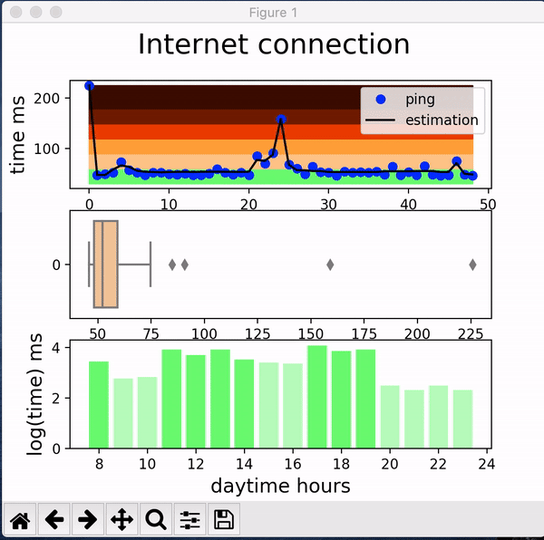

# Measure-Ping

Small project to get a data stream of your ping connection. 



## Execution
  Run the main code
  ```python
  sudo python ping.py
  ```
  Reset data recorded
  ```python
  python delete.py
  ```

## Dependecies
  Dependecies need it to run the code.
  * [Numpy](https://numpy.org/)
  ```python
  pip install numpy
  ```
  * [Matplotlib](https://matplotlib.org/)
  ```python
  pip install matplotlib
  ```
   * [seaborn](https://seaborn.pydata.org/)
  ```python
  pip install seaborn
  ```

  * [sklearn](https://scikit-learn.org/stable/)
  ```python
  pip install scikit-learn
  ```
  * [pythonping](https://pypi.org/project/pythonping/)
  ```python
  pip install pythonping
  ```
